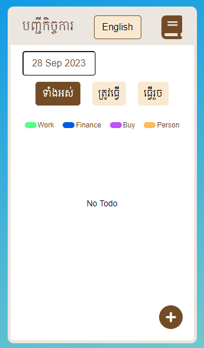
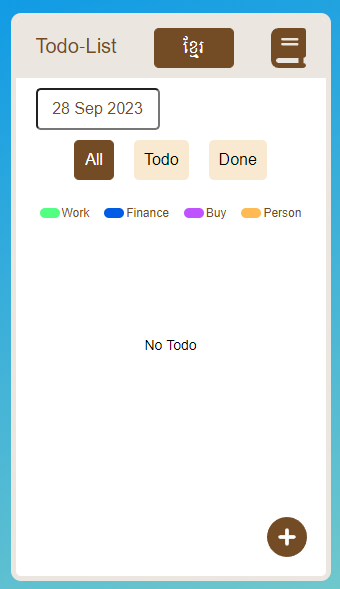

# Todo-List (បញ្ជីកិច្ចការ)

Hi! This is **PRAK Sambath** from **Above and Beyond School**. I create this Todo-List app to helps users manage their tasks and goals. It allows users to create, edit, delete, and organize their tasks in a simple and intuitive interface.

## Table of content

1. [Project Description](#1-project-description)
2. [Features](#2-features)
3. [User Interface](#3-user-interface)
4. [Installation](#4-installation)
5. [Usage](#5-usage)
6. [Code Convention Guide](#6-code-convention-guide)
7. [Work Flow](#7-work-flow)
8. [Note](#8-note)
9. [Framework Library](#9-framework-library)

## 1. Project Description

Project Name: **Todo-List**  
Product Type: **WebApp**  
Repo Address: **https://github.com/PrakSambath/todo-list-webapp**  
Programming Technology: **React**

## 2. Features

- **Task creation**: Users can create new tasks by entering a title, description, time, category, and other details (next update).
- **Task editing**: Users can modify existing tasks by changing any of the information they entered when creating the task.
- **Task deletion**: Users can delete tasks that they have completed or no longer need.
- **Task organization**: Users can filter their tasks by status.
- **Data persistent**: Users don't lost their data after closing browser window, because all tasks have been store in browser local storage.
- **Language**: Users can use two languages English and Khmer.

## 3. User Interface

[Khmer language]

[English language]

UI Design using Figma. To check the source file visit this [link](https://www.figma.com/file/PfJMiXFFavbeQqURj2P39L/Todo-List?type=design&node-id=6%3A309&mode=design&t=ek02V7xTqGjXeMZ5-1)

## 4. Work Flow

To see app work flow please check this [figma flow](https://www.figma.com/proto/PfJMiXFFavbeQqURj2P39L/Todo-List?page-id=0%3A1&type=design&node-id=6-218&viewport=224%2C454%2C0.5&t=qUENHLXSGdvNf9oU-1&scaling=min-zoom&starting-point-node-id=6%3A218&mode=design)

## 5. Installation

No need to download.  
Just open the link in the repository description in browser

## 6. Usage

To learn how to use please check this [guide.](https://drive.google.com/file/d/11w7unaj_3mOJgVyugxKara6f5Yb52t2Q/view?usp=drive_link)

## 7. Code Convention Guide

All details about the source code structure please visit this [page.](./src/docs/convention.md)

## 8. Note

I create this project depend on some frameworks.

## 9. Framework Library

- [Node](https://nodejs.org/en)
- [React](https://react.dev/)
- [Vite](https://vitejs.dev/)
- [Font Awesome](https://fontawesome.com/)
- [React Datepicker](https://reactdatepicker.com/)
